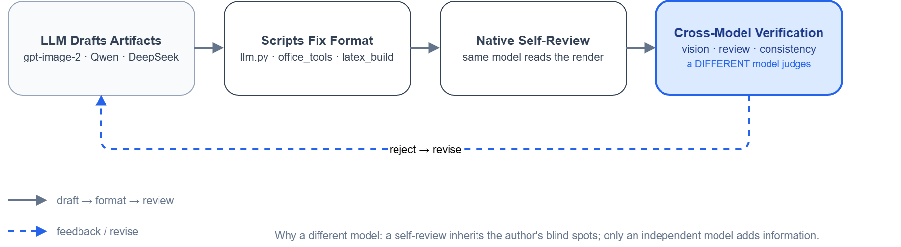

# Agent Useful Skills

[](https://github.com/Azzygoatcoder/agent-useful-skills/actions/workflows/verify.yml)

**模块化 AI 科研/工程技能集合（Claude Code / DeepSeek Harness 通用）。** 把「读论文 → 画图 → 写文档 → 安全审计」这些重复任务，沉淀成可复用的 skill + 脚本，每个模块自带验证环。

> 一句话：**LLM 写中间产物 → 脚本固化格式 → 跨模型验证环兜底**。

> 全貌索引（模块→skill→脚本→验证方式）：见 [skeleton.md](skeleton.md)。

<p align="center">
  
</p>

## 设计原则（为什么这么设计）

| 原则 | 含义 |
|------|------|
| **验证环** | AI 生成的图/内容，用**独立模型**兜底——vision 渲染复核、review 对抗评审。不盲信单次输出。注意这是"独立性"而非"补能力"：宿主模型自带的原生视觉已经能看图，但**同模型自评会继承同一套盲点**，所以复核仍要走另一个模型 |
| **场景判定 + 自进化日志** | 每个 skill 先判「给谁看、什么深度」，每次实战把教训写回 skill，越用越强 |
| **工具不堆积** | 新工具先问「有没有真正新增的能力」，有才吸收，重复轮子不装。**能力被宿主吸收后，工具要重新定位或退役**——例如原生视觉出现后 `vision.py` 从"代眼"改为"独立复核" |
| **配置走 env** | 脚本优先读环境变量，兜底 Claude Code 本地设置。**仓库不硬编码任何供应商端点或密钥** |

> **设计灵感**：科研骨架的设计哲学（跨模型评审循环、对抗验证）受 [ARIS](https://github.com/wanshuiyin/Auto-claude-code-research-in-sleep)（arXiv:2605.03042）启发，未直接使用其代码。详见 [THIRD-PARTY-NOTICES.md](THIRD-PARTY-NOTICES.md)。

## 仓库结构（monorepo）

```
agent-useful-skills/
├── index.mjs / package.json / cordis.patch.yml  # DSH 插件外壳（dsh.bundle，把全部技能注册进 ctx.skills）
├── plugins/     # 可独立安装的 Claude 插件（有 .claude-plugin）
│   ├── code-security-skills/
│   └── superpowers/
├── skills/      # 独立 skill（单 SKILL.md，非插件）
│   └── storage-analyzer/
├── archive/     # 归档 skill（保留在仓库，默认不注册）
├── bin/         # 共享辅助脚本
└── latex-templates/
```

## 包含的模块

### 插件（`plugins/`）

| 插件 | 版本 | 说明 |
|------|------|------|
| [Code Security Skills](plugins/code-security-skills/) | v1.4.3 | 系统化安全审计：场景分流 → 并行探索 → 深度验证（跨模型对抗）→ 报告 → 增量重审计 + 状态追踪工具 |
| [Dev Workflow](plugins/dev-workflow/) | v2.0.1 | Git 协作与发布：issue / PR / review / release（单技能覆盖全链） |
| [Superpowers（本地改版）](plugins/superpowers/) | 6.2.0-local | superpowers fork + 科研骨架自定义 skill |

### 自定义 Skills（`plugins/superpowers/skills/`）

| Skill | 用途 |
|-------|------|
| figure-drawing | 论文制图：概念图 / 精确数据图 / 技术架构图 场景分流，原生读图自检 + 独立模型复核 |
| paper-reading | 论文阅读：搜索入库 / 防撞车 / 快速读 / 精读（六节模板 + 置信度分级） |
| office-tools | Office 写作：md→docx/pptx（公式转原生方程）、Excel 处理、提图 |
| paper-writing | 论文写作一条龙：venue 选模板 → 模块化写作 → 编译页数检查 |

### 独立 Skill（`skills/`）

| Skill | 用途 |
|-------|------|
| [storage-analyzer](skills/storage-analyzer/) | 只读磁盘存储分析：三色分级清理决策 + 交互式 HTML 报告（第三方改编，MIT） |

### Helper 脚本（`bin/`）

| 脚本 | 用途 | 依赖 |
|------|------|------|
| vision.py | **跨模型识图（独立第二意见）**——宿主模型已自带原生视觉，本脚本用于验证场景 | `LLM_API_URL` + key（env） |
| review.py | 跨模型对抗评审（kill-argument 结构化 JSON，Qwen3.5-397B） | `LLM_API_URL` + key（env） |
| gen-image-mcp.cjs | 通用生图 MCP server（OpenAI 兼容；`.cjs` 因仓库为 ESM） | `GEN_IMAGE_URL` / `GEN_IMAGE_PROVIDERS`（env） |
| office_tools.py | Office 处理（Excel / pandoc md→docx/pptx / 提图） | openpyxl + pandoc（extras `[office]`） |
| latex_build.py | LaTeX 模板库管理（new/build/pages） | latexmk + xelatex |
| data_plot.py | 期刊级数据图（样式 / 数据耦合保存） | matplotlib/pandas/numpy（extras `[plot]`） |
| security_audit_tools.py | 安全审计报告状态管理（自动探测报告路径） | 标准库 |
| fig2drawio.py | 论文图 → draw.io 复刻 | `LLM_API_URL` + key（env） |
| consistency_check.py | 矢量图一致性检查 | `LLM_API_URL` + key（env） |
| check_skills.py | 校验 SKILL.md 是否符合 DSH 规则 + 清单/交叉引用/插件版本/配图一致性（`--strict`、`--no-refs`） | 标准库 |
| export_diagram.py | 配图导出：HTML 图源 → 独立 `.svg`（补 xmlns/prolog/webfont）；`--png` 出 PNG、`--check` 查漂移 | 标准库（PNG 需 rsvg-convert） |
| redeploy-skills.ps1 | DSH 技能链接部署/自愈/校验（Windows junction / POSIX symlink，`-Check` 只读模式） | pwsh 7 |

## 快速开始

```bash
# 识图：宿主模型（DeepSeek V4.1+）自带原生视觉，直接读图即可，无需脚本
#   仅在需要「与作者模型不同的独立判断」时才调 vision.py（验证场景）
python bin/vision.py <image_path> "这张图的渲染有没有错？"

# markdown → Word（公式转 OMML 原生方程）
python bin/office_tools.py md2docx 笔记.md 报告.docx --toc

# 期刊级数据图（自动双出 pdf+png+csv）
python bin/data_plot.py demo

# 安全审计
#   触发 code-security-audit skill，或直接用 /audit
```

## 安装

### 插件

```bash
claude plugins install https://github.com/<your-org>/agent-useful-skills --path code-security-skills
```

### Skills

`superpowers/skills/` 下的 skill 复制或符号链接到 `~/.claude/skills/`：

```bash
# macOS / Linux
ln -s "$(pwd)/superpowers/skills/paper-reading" ~/.claude/skills/paper-reading
# Windows（junction）
New-Item -ItemType Junction -Path "$env:USERPROFILE\.claude\skills\paper-reading" -Target "$pwd\superpowers\skills\paper-reading"
```

### Helper 脚本

`bin/` 下的脚本可直接 `python bin/<script>.py` 调用，也支持 `pip install -e .` 一键安装为 console 命令（推荐，不依赖 junction）。

核心命令（`review` / `vision` / `check-skills` / `latex-build` / `security-audit-tools` 等）**零第三方依赖**；带可选依赖的能力按用途分组，避免为用一个命令装齐全部重依赖：

```bash
pip install -e .                 # 核心命令
pip install -e ".[office]"       # + openpyxl / python-docx / python-pptx / PyMuPDF（Excel、Word、PPT、PDF 提图）
pip install -e ".[plot]"         # + matplotlib / pandas / numpy（期刊级数据图）
pip install -e ".[all]"          # 全部

review file.md           # 跨模型对抗评审（结构化 JSON）
vision img.png "渲染有没有错"   # 跨模型识图复核（看懂图用原生读图即可）
office-tools md2docx a.md b.docx      # md→docx 走 pandoc（无需 extras）
office-tools extract pdf 论文.pdf --outdir 图/ --min-size 250 --min-kb 5   # 需 [office]
data-plot demo                        # 需 [plot]
latex-build list
security-audit-tools list             # 审计报告状态（自动探测报告路径）
```

### DeepSeek Harness（DSH）接入

本仓库 skills 兼容 DSH（Agent Skills 标准运行时，本机已验证全部技能可注册）。DSH 只识别**单层**技能目录 `<技能根>/<技能名>/SKILL.md`，插件内技能需**逐个**建 junction（不要把整个 `skills/` 目录链过去）：

```powershell
# 用户级技能根：~/.dsh/skills（所有会话）；项目级：<工作区>/.dsh/skills
New-Item -ItemType Junction -Path "$env:USERPROFILE\.dsh\skills\paper-reading" -Target "$pwd\plugins\superpowers\skills\paper-reading"
```

- 校验：`python bin/check_skills.py`（或 `pip install -e .` 后 `check-skills`），确保 SKILL.md 符合 DSH 解析规则
- 自动化部署/自愈（推荐替代手写 junction）：`pwsh bin/redeploy-skills.ps1`（创建缺失链接、清理失效链接）；`-Check` 为只读校验（链接完整性 + frontmatter）。支持 `DSH_HOME` / `DSH_SKILLS` 环境变量覆盖目标目录
- ⚠️ 链接部署下，在 DSH 技能管理界面（如 skill-explorer）中**只用启用/禁用，不要用删除**——删除可能级联到链接目标（即仓库真实文件）
- 注意：`subagent-driven-development/scripts/` 下 3 个无扩展名脚本是 bash，Windows 需在 Git Bash / WSL 下运行

#### DSH 插件安装（dsh-market 一键）

仓库根带有 `dsh.bundle` 声明（`package.json` + `cordis.patch.yml` + `index.mjs`），可作 DSH 插件安装，在 dsh-market / awesome-dsh-plugin 中可见：

```powershell
dsh plugin --profile web add github:Azzygoatcoder/agent-useful-skills
```

- 插件按 `skills.manifest.json` 注册**默认技能清单**（当前 12 个）；仓库中其余单层技能保留为归档/可选，不默认注册（与 redeploy-skills.ps1 同一份清单契约）
- **去重契约**：已通过 junction 部署在 `~/.dsh/skills`（或项目 `.dsh/skills`）的技能名会被插件自动跳过，本地在用的副本优先，不会重复注册；全新机器才会获得插件自带的默认技能
- **默认清单（12）**：`test-driven-development`、`systematic-debugging`、`verification-before-completion`、`subagent-driven-development`、`figure-drawing`、`paper-reading`、`paper-writing`、`office-tools`、`storage-analyzer`、`code-security-audit`、`security-fix-skill`、`dev-workflow`
- **刻意不占 catalog**：`using-superpowers`（元纪律，`disable-model-invocation: true`）——仍可手动调用，但不参与模型自动触发（它的 description 是"任何对话开始时"）。`verify-plugin.mjs` 会断言该字段存在，防止静默失效
- **归档默认不注册（15）**：`brainstorming`、`writing-plans`、`dispatching-parallel-agents`、`finishing-a-development-branch`、`using-git-worktrees`、`requesting-code-review`、`receiving-code-review`、`writing-skills`、`self-evolve`（原 meta/流程类）；以及合并掉的 `audit`、`reaudit`（→ `code-security-audit`）、`issue-skill`、`pr-skill`、`release-skill`、`review-skill`（→ `dev-workflow`）。目录都在 `archive/`，每个附 `README.md` 说明合并原因与原件，如需要可在 `skills.manifest.json` 中加回
- 白盒自检：`node bin/verify-plugin.mjs`（需仓库根 `node_modules/@deepseek-ai/dsh-skill-filesystem` 可解析，见 `verify-plugin.mjs` 头部注释）

## CI（`.github/workflows/verify.yml`）

上面这些门禁在 CI 上自动跑，**四个组合**：`ubuntu` / `windows` × Python `3.9` / `3.11`。
（3.9 是 `pyproject.toml` 声明的 `requires-python` 下限——声明了下限就该被真实检验。）

每一步都能在本地原样复现，且**全部离线**（不调 LLM/MCP，不需要密钥）：

```bash
python -m compileall -q bin tests              # 语法（按 matrix 的 Python 版本）
python bin/check_skills.py --strict            # DSH 契约 / 清单 / 交叉引用 / 插件版本 / 配图漂移
python tests/test_bin_contracts.py             # review 截断契约 + 审计 --reason 往返
npm install --no-audit --no-fund
node bin/verify-plugin.mjs                     # 注册契约 / 去重 / 候选形状
python bin/export_diagram.py --check <图源.html> ...   # 配图派生是否同步
pwsh bin/redeploy-skills.ps1 -Check            # 部署完整性（CI 先造 DSH_HOME，见 tests/make_dsh_home.py）
```

本地一次跑完：`python tests/test_bin_contracts.py && python bin/check_skills.py --strict`。

> `tests/` 下是**离线可跑的契约测试**——凡是能用 stub 替掉网络调用的行为契约都放这里，
> 这样可以进 CI；需要真调模型的部分不进来。

> **校验范围是全仓库**，`plugins/superpowers/` 不例外。它虽然 fork 自上游（且**不跟随上游更新**），
> 但已经过本地改造、是要维护并改进的代码（见 [plugins/superpowers/CLAUDE.md](plugins/superpowers/CLAUDE.md)：
> 「永不更新上游，原版 MIT 可自由修改」）。**"不跟随上游"是为了可以自由改，不是不去动它**——
> 该目录里我们自己的 skill（figure-drawing / paper-reading / paper-writing / office-tools）
> 与沿用下来的那些，接受同样的检查与同样的改进。

## 密钥配置

脚本优先读环境变量，兜底 `~/.claude/settings.json`（Claude Code 本地设置）：

```bash
export LLM_API_URL="https://api.siliconflow.cn/v1/chat/completions"
export SILICONFLOW_API_KEY="sk-..."

# 识图后端一键切换（可选，默认 siliconflow）
export VISION_PROVIDER="sensenova"   # 自动带出 URL + 模型 + SENSENOVA_API_KEY
```

## 许可证

[MIT](LICENSE) · 第三方内容归属见 [THIRD-PARTY-NOTICES.md](THIRD-PARTY-NOTICES.md)
