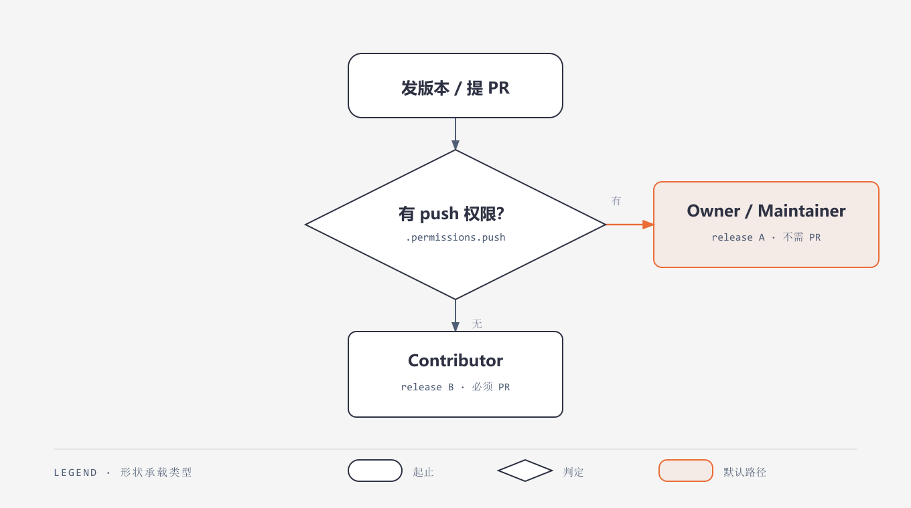

# Dev Workflow

> **v1.0.1** — Git 协作与发布技能集合：提 PR、发版本、issue、code review。

## Skills

| Skill | 角色 | 判据 |
|-------|------|------|
| [pr-skill](skills/pr-skill/SKILL.md) | 提 PR（fork 工作流） | 无上游 push 权限（contributor）或想走评审（maintainer） |
| [release-skill](skills/release-skill/SKILL.md) | 发版本（tag + release） | 有 push 权限 → 直推；无 → fork-PR |
| [issue-skill](skills/issue-skill/SKILL.md) | issue（提/分诊/处理/转 PR） | 角色无关（谁都能提）；分诊关闭是 maintainer 专属 |
| [review-skill](skills/review-skill/SKILL.md) | PR review（看/评审/合并） | 评审者（有 merge 权限的 maintainer/owner） |

## 共用判据

`git remote -v` 看 origin 是「权威仓库」还是「你的 fork」：

- origin = 权威仓库 → Owner / Maintainer → 直推（release 走 A，pr 不需要）
- origin = 你的 fork → Contributor → fork-PR（release 走 B，pr 必须）

## 协作流全景

PR / release / issue / review 四个协作流已覆盖。剩余：GitHub Discussion（无专用 gh 命令）、CI 自动化（release 后自动跑测试）暂缓。

## 版本历史

| 版本 | 日期 | 变更 |
| ---- | ---- | ---- |
| 1.0.1 | 2026-08-30 | review-skill 去除对归档流程 skill 的依赖，description 精简 |
| 1.0.0 | 2026-08-13 | 初始：pr / release / issue / review 四技能，push 权限判定 |
