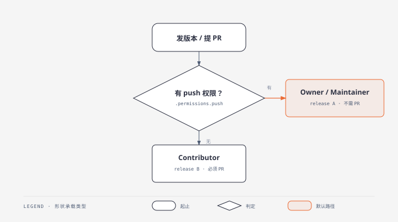

# Dev Workflow

> **v2.0.2** — GitHub 协作与发布：一个技能覆盖 issue → PR → review → merge → release 全链。

## Skills

本插件只注册**一个**技能：

| Skill | 覆盖场景 | 判据 |
|-------|---------|------|
| [dev-workflow](skills/dev-workflow/SKILL.md) | A issue（提/分诊/处理/转 PR）· B PR（fork 工作流）· C review（看/评审/合并）· D release（bump/tag/Release） | 统一用 push 权限判角色（见下） |

场景细节在 `skills/dev-workflow/references/`：`issue.md` / `pr.md` / `review.md` / `release.md` /
`code-review-checklist.md`（PR 内代码评审清单）。

> **v2.0.0 合并说明**：原先拆成 issue-skill / pr-skill / review-skill / release-skill 四个同级技能。
> 它们本是一条链，共享同一套 remote 约定与 push 权限判据、互相引用，却各自占一条 catalog、
> 让「我该调哪个」成为每次都要做的决策。已合并为一个入口 + 四份 references；
> 被合并的四个归档在 `archive/{issue,pr,review,release}-skill/`（附合并原因与原件）。

## 共用判据

**先统一 remote 命名，再谈角色。** `origin` 本身不携带含义——git 把「你 clone 的那个仓库」叫 origin，所以它可能是权威仓库，也可能是你的 fork。

| remote | 含义 |
|--------|------|
| `origin` | **你 clone 的那份**（可能=权威仓库，也可能=你的 fork） |
| `upstream` | **权威仓库**（仅当它与 origin 不同时存在） |

判定用**权限**而不是名字：

```bash
gh api repos/{owner}/{repo} --jq .permissions.push   # true = 有直推权限
```

- 有 push 权限 → Owner / Maintainer → 直推（release 走 A，PR 不需要）
- 无 push 权限 → Contributor → fork-PR（release 走 B，PR 必须）

若你是「只 clone 了自己的 fork」而没有 `upstream`，先补上再按上面判：

```bash
git remote add upstream https://github.com/<权威owner>/<repo>.git
```

> ⚠️ 写操作（push / gh release / gh pr）一律**显式指名 remote 或 `--repo`**，不要依赖 `gh` 的自动推断——多 remote 时它可能挑错目标。



<sub>图源 `assets/push-access-flowchart.html`（单文件内联 SVG），`.svg` / `.png` 由它导出。</sub>

## 协作流全景

issue → PR → review → merge → release 五段已覆盖，链式交接写在 SKILL.md（每个场景跑完告诉用户下一步）。
剩余：GitHub Discussion（无专用 gh 命令）、CI 自动化（release 后自动跑测试）暂缓。

## 版本历史

| 版本 | 日期 | 变更 |
| ---- | ---- | ---- |
| 2.0.2 | 2026-09-21 | **修掉一条会静默出错的发布流程**（来自另一个项目的实战教训）。原 `release.md` **无条件**教人手跑 `gh release create` —— 在「CI 自动发版」的仓库里照做就会与 tag 触发的 workflow **抢跑**，而且**失败是静默的**：workflow 的创建步骤看到 Release 已存在便跳过（幂等本身没错），但上传产物那步挂在创建步骤的输出上（`if: steps.create.outputs.upload_url`）→ 一并跳过，最终留下一个**有 notes、看着正常、却没有任何产物**的 Release。本次：①新增「发布机制：先确认由谁创建」一节，并列为通用准备里**必须最先做**的一步；②场景 A 第 4 步改为**按机制分叉**，新增第 5 步「核对产物（必做）」—— 与上一版对比 `gh release view --json assets`；③补恢复步骤，点明 `gh release delete` **不会删 tag**；④补一条给 workflow 作者的规则：创建步骤要幂等但不吞上传；⑤Edge cases 补三条 |
| 2.0.1 | 2026-09-12 | 判定流程图按 diagram-design 规范重制（`push-access-flowchart.{html,svg,png}`）：补 `xmlns`（旧 `.svg` 缺它，作为 `` 嵌入不渲染）；补图例与分支标签；形状/字号/坐标归到 4px 网格；椭圆半径由 24 收到 10（设计系统上限）；HTML 定为唯一图源，SVG/PNG 由它导出 |
| 2.0.0 | 2026-09-12 | **四技能合并为一个 `dev-workflow`**（默认清单 18→12 的瘦身之一）：issue/pr/review/release 是同一条链，合并后第 0 步共用判据只写一次，场景细节外移 references/；被合并的四个归档到 archive/ 并附合并原因。**破坏性变更**：`issue-skill` / `pr-skill` / `review-skill` / `release-skill` 四个注册名不再存在（`/issue`、`/pr`、`/review`、`/release` 触发词仍由 dev-workflow 承接） |
| 1.0.2 | 2026-09-12 | 统一 remote 约定（`origin`=你 clone 的那份 / `upstream`=权威仓库），角色改用 `gh api .permissions.push` 判——此前 pr-skill 与 release-skill 对 `origin` 的定义相反；按 gh 2.92 实测修正 `issue close --reason "not planned"`、`issue develop --checkout/--branch-repo`、`fixes #N` 位置；默认分支检测改用 `gh repo view --json defaultBranchRef`（原命令返回当前分支）；补 `reset --hard` 的 fetch 与未推送提交保护；release-skill 补 notes.md 生成步骤与完整 bump 清单（package.json / VERSIONING.md / 根 README / 插件 README 横幅）；补 1.0.1 遗漏的四技能 description 重写记录 |
| 1.0.1 | 2026-08-30 | review-skill 去除对归档流程 skill 的依赖，description 精简；四技能 description 重写（触发词卫生） |
| 1.0.0 | 2026-08-13 | 初始：pr / release / issue / review 四技能，push 权限判定 |
