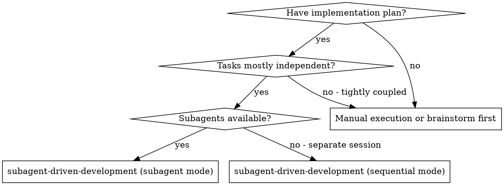

# Subagent-Driven Development

Execute plan by dispatching a fresh implementer subagent per task, a task review (spec compliance + code quality) after each, and a broad whole-branch review at the end.

**Why subagents:** You delegate tasks to specialized agents with isolated context. By precisely crafting their instructions and context, you ensure they stay focused and succeed at their task. They should never inherit your session's context or history — you construct exactly what they need. This also preserves your own context for coordination work.

**Core principle:** Fresh subagent per task + task review (spec + quality) + broad final review = high quality, fast iteration

**Narration:** between tool calls, narrate at most one short line — the
ledger and the tool results carry the record.

**Continuous execution:** Do not pause to check in with your human partner between tasks. Execute all tasks from the plan without stopping. The only reasons to stop are: BLOCKED status you cannot resolve, ambiguity that genuinely prevents progress, or all tasks complete. "Should I continue?" prompts and progress summaries waste their time — they asked you to execute the plan, so execute it.

## When to Use



**Two execution modes (this skill covers both):**
- **Subagent mode (default, recommended):** fresh subagent per task, review after each (spec compliance + code quality), broad whole-branch review at the end. Fast iteration, no context pollution.
- **Sequential mode (no subagents / separate session):** execute tasks inline with review checkpoints. See "Sequential Execution" below.

## Sequential Execution (No Subagents / Separate Session)

When subagents are unavailable, or the plan is executed in a separate session, run it sequentially with checkpoints instead of dispatching implementers:

1. **Load and review the plan.** Read it critically before starting. If you have questions or concerns, raise them with your human partner before executing.
2. **Create todos** for the plan items; mark the first task in_progress.
3. **Execute each task:** mark in_progress, follow each step exactly (the plan has bite-sized steps), run verifications as specified, then mark it completed.
4. **Review at checkpoints.** Run the full verification at the end of each task before moving on — an early catch of drift.
5. **Complete:** verify the branch's tests and diff, then present merge/PR/keep/discard options to your human partner (or follow the repo's normal integration flow).

**Stop and ask, don't guess.** STOP immediately when:
- You hit a blocker (missing dependency, test fails, instruction unclear)
- The plan has critical gaps that prevent starting
- You don't understand an instruction
- Verification fails repeatedly

**Revisit the plan (back to step 1) when** your human partner updates the plan based on your feedback, or the fundamental approach needs rethinking. Don't force through blockers — stop and ask.

**后发先至（依赖栈 LIFO，工作准则）：** 执行中牵出新的**阻塞依赖**（主任务需要才能收尾）→ 趁上下文热**先弹栈解决**，再回主计划。**但栈会溢出**——两个护栏 + 一个例外：
- 只对「阻塞依赖」LIFO；独立/可选改进记 ledger 挂起，不打断主流程
- 某个依赖牵出更大的独立任务 → 记 ledger + 升级给人类，不无限下钻
- 不适用：任务相互独立（顺序无所谓）、需广度覆盖、或时间盒约束时

## The Process

```
Per task:     dispatch implementer → review → fix loop (≤5 rounds) → ledger "complete"
Whole branch: setup → tasks → final whole-branch review → cleanup → present integration options
```

Each step is specified in Setup, The Task Loop, and Final Review below.

## Setup

Ensure the work happens in an isolated workspace (a git worktree or a
separate branch) when available. Never start implementation on a main/master
branch without your human partner's explicit consent.

Conversation memory does not survive compaction. In real sessions,
controllers that lost their place have re-dispatched entire completed task
sequences — the single most expensive failure observed. Track progress in
a ledger file, not only in todos.

- Each plan owns a workspace: at skill start, run this skill's
  `scripts/sdd-workspace PLAN_FILE` — it prints the plan's git-ignored
  directory (`<repo-root>/.superpowers/sdd/<plan-basename>/`), home to
  every artifact for THIS plan: ledger, briefs, reports, review packages.
  Another plan's directory is never yours to read or write.
- Check for this plan's ledger at `<workspace>/progress.md`. If its first
  line names your plan file, tasks with a `Task <N>: complete` line are DONE
  — do not re-dispatch them; resume at the first task without one. A task
  whose last line is a fix round is mid-loop: resume the loop at the next
  round. A ledger whose first line names a different plan file — or a stray
  ledger at the old flat path `.superpowers/sdd/progress.md` — is another
  plan's progress: leave it in place and start your own, fresh.
- Create the ledger with its identity as the first line:
  `# SDD ledger — plan: <plan file path>`.
- The ledger is your recovery map: the commits it names exist in git even
  when your context no longer remembers creating them. After compaction,
  trust the ledger and `git log` over your own recollection.
- `git clean -fdx` will destroy the workspace (it's git-ignored scratch); if
  that happens, recover from `git log`.

Read the plan once, note its context and Global Constraints, and create a
todo per task.

Before dispatching Task 1, scan the plan once for conflicts:

- tasks that contradict each other or the plan's Global Constraints
- anything the plan explicitly mandates that the review rubric treats as a
  defect (a test that asserts nothing, verbatim duplication of a logic block)

Present everything you find to your human partner as one batched question —
each finding beside the plan text that mandates it, asking which governs —
before execution begins, not one interrupt per discovery mid-plan. If the
scan is clean, proceed without comment. The review loop remains the net for
conflicts that only emerge from implementation.

## Model Selection

Use the least powerful model that can handle each role to conserve cost and increase speed.

**Mechanical implementation tasks** (isolated functions, clear specs, 1-2 files): use a fast, cheap model. Most implementation tasks are mechanical when the plan is well-specified.

**Integration and judgment tasks** (multi-file coordination, pattern matching, debugging): use a standard model.

**Architecture and design tasks**: use the most capable available model.
The final whole-branch review is one of these — dispatch it on the most
capable available model, not the session default.

**Review tasks**: choose the model with the same judgment, scaled to the
diff's size, complexity, and risk. A small mechanical diff does not need the
most capable model; a subtle concurrency change does. Scoped re-reviews of
small fix diffs take a cheap-to-mid tier.

**Fix-loop escalation (rounds 4-5)**: use a model at least one tier above
the implementer that got stuck.

**Always specify the model explicitly when dispatching a subagent.** An
omitted model inherits your session's model — often the most capable and
most expensive — which silently defeats this section.

**Turn count beats token price.** Wall-clock and context cost scale with how
many turns a subagent takes, and the cheapest models routinely take 2-3× the
turns on multi-step work — costing more overall. Use a mid-tier model as the
floor for reviewers and for implementers working from prose descriptions.
When the task's plan text contains the complete code to write, the
implementation is transcription plus testing: use the cheapest tier for
that implementer. Single-file mechanical fixes also take the cheapest tier.

**Task complexity signals (implementation tasks):**
- Touches 1-2 files with a complete spec → cheap model
- Touches multiple files with integration concerns → standard model
- Requires design judgment or broad codebase understanding → most capable model

## The Task Loop

The full per-task protocol is in [references/task-loop.md](references/task-loop.md):
dispatch implementer → handle report → task review → fix loop → complete.

**Summary:**
1. **Dispatch the implementer** with a brief file and a report-file path. Never paste session history. One task per dispatch.
2. **Handle the report:** DONE → review; DONE_WITH_CONCERNS → read concerns first; NEEDS_CONTEXT → provide context; BLOCKED → assess and change the model/scope/plan.
3. **Review the task** with a generated diff package. Spec compliance AND task quality are both required.
4. **Fix loop:** ≤5 rounds. Rounds 1-3 resume the implementer; rounds 4-5 use a fresh, more capable implementer. Every round gets a scoped re-review; record rounds in the ledger.
5. **Complete the task:** append the completion line only when the review is clean or every open finding is parked with a ruling.

## Final Review

The full final whole-branch review protocol is in [references/final-review.md](references/final-review.md).

**Summary:**
- Build a review package from branch start to HEAD.
- Dispatch the final review on the most capable model, using [code-reviewer.md](code-reviewer.md).
- If findings come back, dispatch **one** fix subagent for the whole findings list, then exactly one scoped re-review.
- Adjudicate residuals: park with rulings, or stop on load-bearing issues. No second fix wave.

## Finish

When the final whole-branch review is clean and its fixes are merged,
delete this plan's workspace (`rm -rf <workspace>`) — the git history is
the record now. Sibling directories belong to other plans; leave them
alone.

Then present the integration options to your human partner: merge, PR, keep,
or discard. Follow the repo's normal Git workflow; do not invent extra
ceremony.

## Common Rationalizations

| Excuse | Reality |
|--------|---------|
| "Close enough on spec compliance" | Reviewer found spec gaps = not done. Fix or hit the cap and adjudicate — those are the only exits. |
| "I'll fix it myself, dispatching is overhead" | Controller fixes pollute your context and skip review. Resume the implementer. |
| "One more round will converge" | Past the cap, rounds don't converge — the failure is structural. Adjudicate and route. |
| "The reviewer will just find something new anyway" | Scoped re-reviews verify fixes; they cannot wander. New findings on untouched code go to the ledger, not the loop. |
| "This finding is obviously wrong, I'll drop it" | You adjudicate only at the cap, and every ruling is a ledger entry. Silent discards are forbidden. |
| "The fix was small, skip the re-review" | Unreviewed fixes are how regressions land. Every round ends with a scoped re-review. |
| "Reviews slow the loop down" | The loop without reviews is just unverified churn. Reviews are the loop's brakes and steering. |
| "Ledger bookkeeping is overhead" | The ledger is what survives compaction. Controllers without one have re-dispatched entire completed task sequences. |

## Example Workflow

Setup: verify worktree → read plan → create todos → resolve workspace + ledger (fresh).

Task 1: dispatch implementer (brief + report paths) → implementer asks a question, gets answered, then implements, tests, commits, reports DONE.
  → review-package PLAN BASE HEAD → task reviewer: "Spec ✅, quality approved"
  → ledger: Task 1: complete (commits a1b2c3d..d4e5f6a, review clean)

Task 2 (with a fix round): dispatch implementer → reviewer: "Spec ❌ — missing progress reporting; Important: magic number"
  → fix round 1: resume implementer with findings → scoped re-review: all addressed
  → ledger: Task 2: fix round 1/5 (2 addressed, 0 open); Task 2: complete (commits d4e5f6a..b7c8d9e, review clean)

Final: whole-branch review (most capable model) → clean → delete workspace → present integration options.
