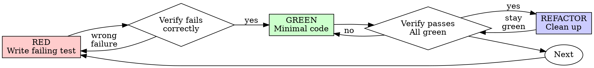

# Test-Driven Development (TDD)

## Overview

Write the test first. Watch it fail. Write minimal code to pass.

**Core principle:** If you didn't watch the test fail, you don't know if it tests the right thing.

**Violating the letter of the rules is violating the spirit of the rules.**

## 场景判定（先定力度，再走流程）

不是所有代码都值得完整 TDD 仪式。先确认这块代码将来会不会被依赖/复用，再选择力度：

| 场景 | 力度 |
|------|------|
| 生产代码、共享库、正式项目、bug 修复、回归防护 | **完整 TDD**：红 → 绿 → 重构，缺一不可 |
| 个人业余项目、探索性脚本、原型、一次性工具 | **轻量 TDD**：先让它跑起来；只对“会长期存在”的核心逻辑补 1-2 个有意义的测试；不要为每个小函数都建测试 |
| 纯 throwaway / 临时验证 | 可以跳过测试，但不要把它混进生产代码 |

> 判断标准：**这段代码如果出错，会不会影响别人/后续/生产？** 不会，就走轻量路径，别让流程拖慢节奏。会，就走完整 TDD，不讨价还价。

## The Iron Law

```
NO PRODUCTION CODE WITHOUT A FAILING TEST FIRST
```

写生产代码前没有失败测试？删掉重来。

**No exceptions:**
- Don't keep it as "reference"
- Don't "adapt" it while writing tests
- Don't look at it
- Delete means delete

**适用边界：** 这条铁律针对**会成为生产/持久代码**的部分。个人探索代码可以快速跑通再补测试，但不能把“没验证过的代码”直接当生产代码提交。

## Red-Green-Refactor（速览）



完整流程、好测试标准、反模式和示例见 [references/tdd-guide.md](references/tdd-guide.md)。

## 核心检查

- 每个新行为有一个失败测试，并且你亲眼看过它失败
- 写最小代码让它通过
- 重构时保持测试全绿
- 测试关注真实行为，不测 mock
- 完整 checklist / good tests / rationalization 表见 [references/tdd-guide.md](references/tdd-guide.md)

## 调试集成

Bug 出现时：写一个能复现该 bug 的失败测试，然后按 TDD 循环走。完整规则见 [references/tdd-guide.md](references/tdd-guide.md)。

## Final Rule

```
Production code → test exists and failed first
Otherwise → not TDD
```

个人/探索代码例外：先跑通，再补真正会被长期依赖的部分。
