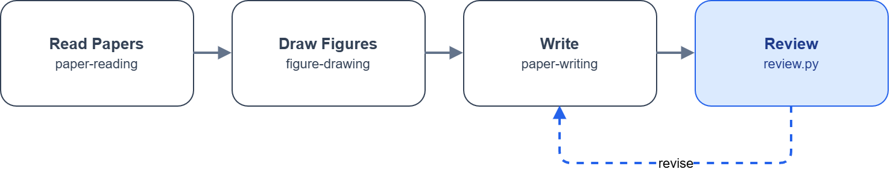

# 科研骨架（Research Backbone）全貌索引

> 一句话：模块化科研工具链，每个模块 = **skill + 脚本/MCP + 跨模型验证**。此文件是新 session / 新协作者的第一入口。

## 模块总览

| # | 模块 | 触发 | 入口 | 后端/依赖 | 验证方式 |
|---|------|------|------|-----------|----------|
| 1 | 识图 | 看图/OCR/读图表 | `vision` 命令 / analyze_image MCP | Qwen3-VL-32B（SiliconFlow） | —（本身是验证器） |
| 2 | 生图 | 概念图/封面/graphical abstract | generate_image MCP | gpt-image-2（私有供应商走 env） | vision 复检 |
| 3 | 评审 | 对抗审查/语义复核 | `review` 命令 | Qwen3.5-397B（SiliconFlow） | kill-argument 结构化 JSON |
| 4 | 绘图 | 架构/流程/数据图 | drawio MCP / fig2drawio / data-plot / diagram-design / fireworks-tech-graph | 多后端 | consistency-check 一致性 + vision |
| 5 | 文献 | 读论文/写阅读报告 | paper-reading skill | arxiv_fetch.py | 置信度 frontmatter + review 复核 |
| 6 | 写作 PDF | 论文/报告/学位论文 | paper-writing skill | latex-templates + latex-build | review 评审 + 页数检查 |
| 7 | 写作 Office | Word/PPT/Excel | office-tools skill | office_tools.py + pandoc | 公式→OMML 原生方程 |
| — | 审计（横向） | 安全审计 | code-security-audit skill | security_audit_tools.py | review 跨模型对抗 |

## 典型跨模块流程

- **论文写作一条龙**：读文献(5) → 绘图(4) → 写作 PDF(6) 或 Office(7) → 评审(3) → 修订重编译
- **制图闭环**：生图(2) → 识图(1) 读结构 → fig2drawio(4) 复刻矢量 → consistency-check 一致性 diff
- **审计闭环**：code-security-audit → review(3) 对抗攻击 findings → 误报过滤

<p align="center">
  
</p>

## 安装与命令

```bash
pip install -e .          # 装 console 命令（推荐，不依赖 junction）
review file.md --json     # 结构化评审（kill-argument）
vision img.png "描述"     # 识图
office-tools md2docx a.md b.docx
latex-build list
```

脚本也可 `python bin/<script>.py` 直调。共享 client 在 `bin/llm.py`（key 解析 / 端点 / 重试 / 结构化 JSON）。

> **默认注册以 `skills.manifest.json` 为准**：DSH 插件与 `redeploy-skills.ps1` 只部署清单内技能；仓库中其余 skill 保留为归档/可选，不占用默认发现目录。

## Skill 目录

**默认注册 12 个**（以 `skills.manifest.json` 为唯一事实源）：

| Skill | 位置 | 场景 |
|-------|------|------|
| dev-workflow | plugins/dev-workflow/skills/dev-workflow | Git 协作全链：A issue / B PR / C review / D release |
| code-security-audit | plugins/code-security-skills/skills/code-security-audit | 安全审计：完整审计 + Phase 4 增量重审与状态追踪 |
| security-fix-skill | plugins/code-security-skills/skills/security-fix-skill | 按 P1-P4 批量修复审计发现 |
| figure-drawing | plugins/superpowers/skills/figure-drawing | 制图 A内部 / B1对外结构化 / B2示意封面 / C快速 / D数据图 |
| paper-reading | plugins/superpowers/skills/paper-reading | 文献 A搜索 / B防撞车 / C快速读 / D精读 |
| paper-writing | plugins/superpowers/skills/paper-writing | 写作 A会议 / B学位 / C报告 / D Office |
| office-tools | plugins/superpowers/skills/office-tools | 已有 Office/PDF 文件的读写与提图（**不含新建图**） |
| storage-analyzer | skills/storage-analyzer | 存储分析 |
| test-driven-development | plugins/superpowers/skills/test-driven-development | 纪律：先写失败测试 |
| systematic-debugging | plugins/superpowers/skills/systematic-debugging | 纪律：先定位根因再改 |
| verification-before-completion | plugins/superpowers/skills/verification-before-completion | 纪律：宣布完成前先验证 |
| subagent-driven-development | plugins/superpowers/skills/subagent-driven-development | 按计划用 subagent 逐任务实施 |

**刻意不占 catalog**：`using-superpowers`（元纪律，设 `disable-model-invocation: true`；仍可手动调用）。

**归档 15 个**（`archive/`，默认不注册）：9 个原 meta/流程类（brainstorming、writing-plans、
dispatching-parallel-agents、finishing-a-development-branch、using-git-worktrees、
requesting-code-review、receiving-code-review、writing-skills、self-evolve）+
6 个合并掉的（`audit`、`reaudit` → code-security-audit；`issue-skill`、`pr-skill`、
`release-skill`、`review-skill` → dev-workflow）。每个归档目录带 `README.md` 说明合并原因，
原件保留为 `archived-SKILL.md`。

> **精简史**：27（初始）→ 18（2026-08-30 归档 meta/流程类）→ 12（2026-09-12 合并同工作流簇 +
> 元纪律技能退出 catalog）。判断依据是「同一工作流被切成多个同级技能」会同时抬高 catalog 成本
> 与误触发概率，而触发词本身基本不重叠（实测 153 对里只有 1 对真冲突），所以重点是**结构合并**
> 而不是改措辞。

## 核心约定（写新 skill 时遵守）

1. **场景判定表**：先判「给谁看、什么深度」再走流程
2. **自进化日志**：每个 skill 尾部 `## 自进化日志`，实战教训写回；晋升见 self-evolve skill
   （上游派生技能按 `plugins/superpowers/CLAUDE.md`「不覆盖上游已调优内容」豁免，
   `bin/check_skills.py` 里有显式豁免名单）
3. **跨模型验证**：生成物用独立模型兜底（vision 渲染 / review 语义）
4. **配置走 env**：私有供应商/key 只在本地环境变量，仓库天然不含（默认 SiliconFlow 公开）
5. **一个工作流 = 一个技能**：同一件事的多段（审计/重审、issue/PR/review/release）放同一技能的不同
   场景或 `references/`，不要再拆成同级技能；新增前先跑 `bin/check_skills.py` 与
   `node bin/verify-plugin.mjs`
